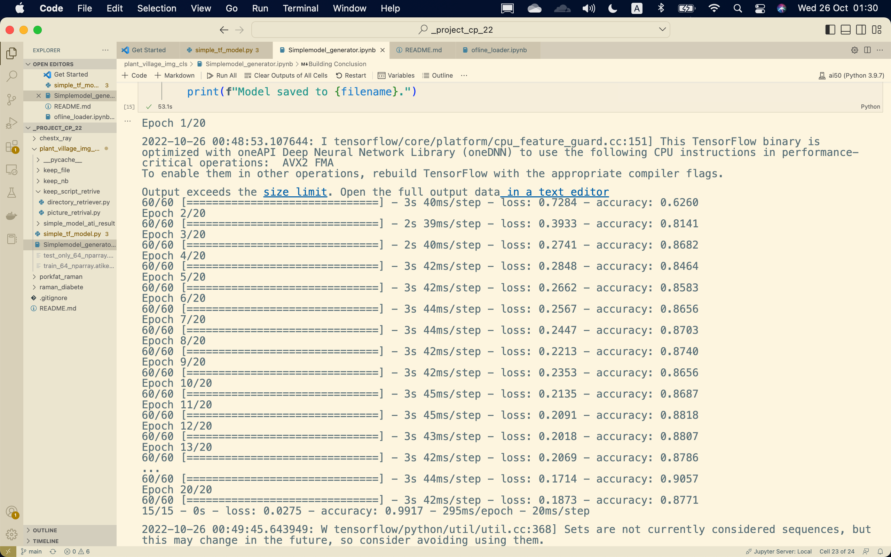

# MLproject_group2work
> this respiratory created for implement few ML model.

## TOPIC
- ### **MAIN** [Raman spectroscopy of Diabetes](https://github.com/AtiChetsurakul/DataScienceAndMLProjects/tree/main/Diabete_detection_withRamanSpec)
- ### [Plant Village](https://github.com/AtiChetsurakul/DataScienceAndMLProjects/tree/main/ImgClassif_withPlantVillage)
- ### [EEG Motor Movement/Imagery](https://github.com/AtiChetsurakul/DataScienceAndMLProjects/tree/main/EEG_motorIg)
- ### ~~RAMAN FOR Depth profiling of ADIPOSETISSUE~~
-----------------------------------------------------------------

## Contributor
- st123009	Ati Tesakulsiri 
- st123418	Sorn Rambo [link](https://github.com/sornrambo)
- st122934	Duc Nguyen [link](https://github.com/maskedclone)
- st123225	Pyae Sone Kyaw [link](https://github.com/soneeee22000)
- st122825	Min Set Aung [link](https://github.com/minsetaung1995)
- st122910	Nguyen Thai Anh [Link](https://github.com/anhnguyen1008)

-----------------------------------------------------

- ### objective
	- To send as class project home work for `CP for DSAI` class as final project.
	- To learn more on the process for implementing ML model.

-------------------------------------------------------------

### Overview
- RAMAN diabete
	- ##### Scope and Topic understanding
	- To indicate diabetes by using `Blood Biomarker` or `Analyte` called `advanced glycation end products` with `Raman spectroscopy`
    - In this dataset there are 6 Analyte including
        - 3-deoxyglucosone
        - glyoxal
        - glyoxal-lysine dimer GOLD
        - methylglyoxal
        - methylglyoxal-derived hydroimidazolone MG-H2
        - pentosidine
      
    - what is these 6 compound ?**[2]** 
    
- Advanced glycation end products (AGEs) are modifications of proteins or lipids that become nonenzymatically glycated and oxidized after contact with aldose sugars.1,2 Early glycation and oxidation processes result in the formation of Schiff bases and Amadori products. 
- To see more look at `Diabete_detection_withRamanSpec` directory

  

- Plant Village
	- To classify image we plan to use CNN method to do this project
	- We implement basic model using `Tensorflow` with 3 class
	- with ETL done with picklefile and img size of 64*64
	- at `ImgClassif_withPlantVillage` directory

  

- EEG Motor Movement/Imagery
	- file download method implemented
	- `EEG_motorIg` directory

-------------------------------------------------------
- ### October Progress 
	- RAMANporkfat
		- ~~The `http://www.models.life.ku.dk/RAMANporkfat` dataset are unable to load due to it is `.mat` file~~.
		- The loaded data are not well labeled; it quite hard to use.
		- Since scope are too  wide, format is not so good and reference paper are quite old, I put this topic **onhold**.

	- RAMAN diabete
		- Understanding dataset and paper. > done
		- ETL > Done
		- Prelim > find some different baseline signal 
		- ABORT LIKEly to be done quite easy.
	
	- PlantVillage
		- ETL with both ofline and online.
			- might go with online `deeplake` because it easier.
		- Using **simple** `tensorflow` model blueprint that created from my previous class.
			- fitting with Deeplearning (maxpool,convolu2D,some hidden layer)
			- with 80% of 300 sample (3 labels) was choose and photo was resized to 64*64
				- background
				- stawberry
				- tomato
			- Result -> greate accuracy
				- <h3>How to use the script</h3>
					- for Retriving data first on `keep script retrive` directory, the `picture_retrival.py` and `directory_retrive.py` are need
					- you need to change some in `picture_retrival.py` other than that you can retrive a `list` of picture using script
					- on `simple_tf_model.py` is a **temp** model blueprint to test the data.
					- On `Simple model` notebook you will see how I use the data to generate simple model
					- asset of model are at `simple_model_ati` directory.
		

		- TODO > study
		- We need to rescale the imagevalue ( the value of the color).
	
<!-- - ### Nov Progress
	- 11/10/2022
		- Raman for diabete type 2
			<!-- - On hold || dataProblem 
			- Finish Baseline model **without** implement the Validation set.

			- I Put this topic on hold due to It seem too easy to solve.

		- Plant Village
			- Baseline model implemantation

		- EEG EEG Motor Movement/Imagery Dataset
			- Retrive dataset from [here](https://physionet.org/content/eegmmidb/1.0.0/)
			- starting -->

